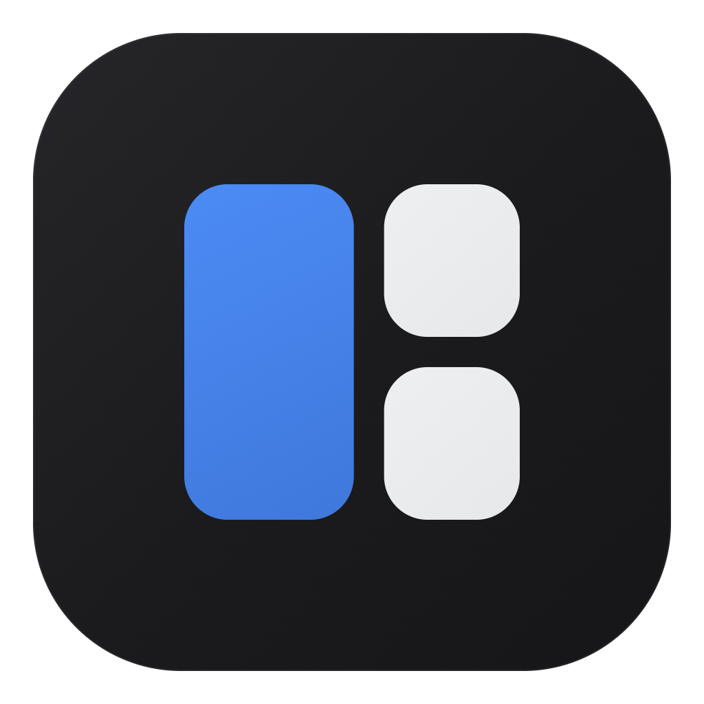

<div align="center">



# HDContainer

### Group the windows for a task into one app — and switch your whole workspace with a single Alt+Tab.

[](https://github.com/helldogsify/HDContainer/releases/latest)
[](https://github.com/helldogsify/HDContainer/releases/latest)
[](LICENSE)

</div>

---

## The problem

You almost never work in a single app. A task is a **set of windows open together** — an editor, a browser to check your changes, a terminal, maybe a show playing on the side. That's your rig for *that* task.

Then you switch to something else — writing a document that you want full‑screen. When you come back to coding, you're mashing **Alt+Tab** to dig out each window and dragging them back into place. Every single time. And after a reboot you rebuild the whole layout from scratch.

## What HDContainer does

It makes a set of windows behave like **one program**. You drop everything a task needs into one **container** — from then on it's a single taskbar button and a single Alt+Tab entry.

So switching tasks becomes **one keystroke**: Alt+Tab and your entire working set flips at once — coding rig out, writing rig in, right where you left it. No window hunting, no re‑arranging.

> Coding → **Alt+Tab** → your research paper. One press, the whole set of tools in front of you changed.

And it's **not** a hack that jams windows inside another and breaks your typing. Every window stays a normal window, so the keyboard, clipboard and the **Alt+Shift** layout switch all keep working — HDContainer only *groups* them.

It lives in the **system tray** — no main window in your way.

## How you use it

- **Make a container**, give it a name, and pick its windows from an Alt+Tab‑style preview grid.
- **Run several containers at once** — each is its own taskbar button. Alt+Tab between them like between apps.
- **Color‑label** a container so you can tell your "work" rig from your "research" rig at a glance.
- **Give it an icon** — drop in any image (PNG, JPG, WebP…) like setting an avatar; it's cropped to a square (transparency kept) and becomes the container's taskbar and shortcut icon.
- **Save it as a desktop shortcut** — one click reopens the container. Windows that are still open snap back exactly where they were; apps that were closed get relaunched (their exact size/position can't always be reproduced). Your workspace survives reboots.
- **Tick a container in the tray menu** to switch it on or off — no digging into submenus.
- **Minimize one window** inside a container and it steps out on its own; restore it and it snaps back into the group.

<div align="center">

<br><sub>Color-label each container to tell your workspaces apart</sub>
</div>

## Install

1. Download **[HDContainer-Setup.exe](https://github.com/helldogsify/HDContainer/releases/latest)**.
2. Run it — installs per‑user, **no admin rights**.
3. Launch **HDContainer**; it sits in the system tray. Right‑click it to start.

It quietly checks GitHub for new versions and can update itself (toggle in **Settings**). Prefer no installer? Grab the portable **HDContainer.exe** from the same release.

Available in English, Русский, Español, Português, Deutsch, Français and 中文 (auto‑detected, switchable in Settings).

## How it works under the hood

Each active container is an invisible **owner window** — a real, minimizable window kept fully transparent via a layered surface (so Win+D and the taskbar button genuinely minimize the whole group). Member windows are made *owned* by it via `SetWindowLongPtr(GWLP_HWNDPARENT)` — they are **not** reparented. Ownership alone gives you: members float above the (invisible) host, hide and show with it (group minimize, Win+D), and collapse into one taskbar/Alt+Tab entry — all **without merging input queues**, which is exactly why native typing and the global Alt+Shift layout switch keep working. A unique per‑window AppUserModelID keeps each container as its own taskbar button.

Mostly stdlib: one Python file, `tkinter` + `ctypes`, plus [Pillow](https://python-pillow.org/) for container icons (decoding any image, square‑cropping, writing the `.ico`).

## Build from source

Needs Windows, [Python 3.10+](https://www.python.org/) with [PyInstaller](https://pyinstaller.org/), and [Inno Setup 6](https://jrsoftware.org/isdl.php) for the installer.

```powershell
pip install pyinstaller pillow
powershell -ExecutionPolicy Bypass -File build.ps1   # exe + installer
```

Portable exe only:

```powershell
python -m PyInstaller --onefile --noconsole --name HDContainer --icon HDContainer.ico --clean -y window_container.py
```

## Support

Vibe‑coded by **hdk** with [Claude Code](https://claude.com/claude-code). Free for everyone.

If it saved you some window‑juggling, you can tip the author:

**USDT · TRON (TRC20)**
```
TWG8Y5EyaqQf8GsJKJVhcaAMFZxxHoPWzC
```

## License

[MIT](LICENSE) © hdk
